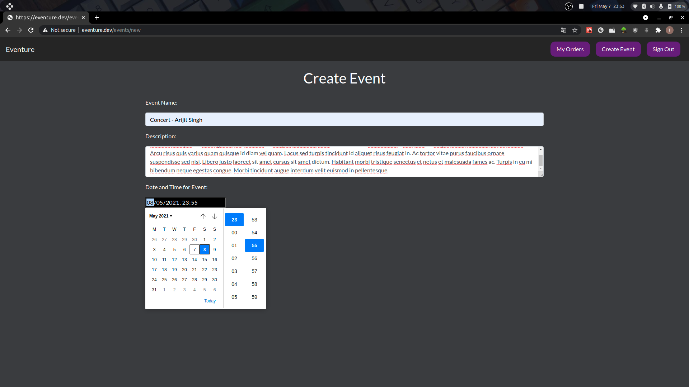

# Documentation

## Video Demonstration:

https://user-images.githubusercontent.com/53286842/117527118-264fc400-afe7-11eb-905c-9c0de68bdd43.mp4

If you want to see this video in youtube, then here is the [link](https://www.youtube.com/watch?v=TRNRVy1k-Jg)

## SignUp:

For testing:

email: test@test.com
password: password

Errors:

- Email must be valid : When email is not valid
- Password must be between 4 and 20 characters : When password is not valid
- Email is already!! : When email is already in use

## SignIn:

email: test@test.com
password: password

Errors:

- Email must be valid : When invalid email
- You must supply a password : When password is not supply
- Invalid Credentials : when email or password are wrong

## Create Event:

- You need to be signed to create a event

- Event Name: enter event name
- Description: Describe the event
- Date and Time for Event: Right side at end tthere is one invisble button to toggle datetime picker
- Total Tickets: Total tickets availble to buy
- Price: Price to pay per ticket

Errors:

- All fields are required

## Purchase a Ticket:

- Click on card

- Click on purchase

- Pay for ticket in given time else order will be automatically cancelled.

- At present it will cancelled after 1 minutes (We can extend time, but for testing, I'm taking 1 minute )

Pay using Stripe

Payment Successful

- One cannot buy ticket before 10 minutes of the starting of the event.

- One cannot sell or pay for ticket before 10 mintues of the starting of the event.

- Ticket for the event will not be visible if the event has been started

## My Orders:

- Here one can see the order he/she made or cancelled.

- Here there are three sections: Purchased Tickets, Pending Payments and Order Logs:

- One can sell the purchased ticket if that event is yet not started.

